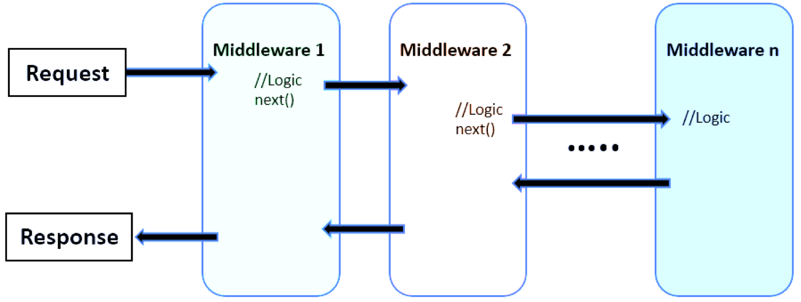
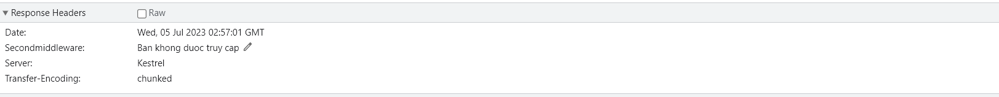

# Kiến thức học được (05/07/2023) về phần Middleware và Pipeline:
- Khi host chạy thì nó sẽ tiếp nhận các HTTP request. Những request khi server nhận được sẽ được cho đi qua luồng gọi là pipeline. Ta sẽ cần xậy dựng một chuỗi các middleware để request đi qua. Khi response trả về nó sẽ cũng đi qua chuỗi Middleware này nhưng đi ngược chiều lại về client
- Khi sử dụng:
```
app.Run(async context =>
{
    
});
```
thì ta đã tạo ra 1 terminal Middleware. Khi request đi đến Middleware này thì nó sẽ không gọi đến các Middleware khác, do đó các request khi đến đây giống như `trạm cuối` rồi nên sẽ dừng tại đây và bắt đầu response về cho client. Tại thời điểm này pipeline chỉ có 1 Middleware là Middleware ở trên (kí hiệu M1)
+ Pipeline hiện tại: M1
- Định nghĩa chuẩn về Pipeline: trong ứng dụng ASP.NET Core, các middlware kết nối lại với nhau thành một xích, middleware đầu tiên nhận HTTP Request, xử lý nó và `có thể chuyển` cho middleware tiếp theo `hoặc trả về ngay HTTP Response` (nếu middleware không chịu chuyển cho middleware tiếp theo thì nó gọi là `terminal Middleware`). Chuỗi các middleware theo thứ tự như vậy gọi là pipeline.

- Sau khi đăng kí 1 Middleware khác thông qua `app.UseMiddleware<FirstMiddleware>();` thì pipeline lúc này:
pipeline: FirstMiddleware -> M1

- Có một điều lưu ý: một khi đã `WriteAsync` để viết nội dung content cho Response thì ta không thể add header cho nó. Do đó nếu muốn add header thì phải add trước khi `WriteAsync`. Việc 1 middleware phía trước đã `WriteAsync` và chuyển `HttpContext` đến Middleware tiếp theo và tại đây ta lại `WriteAsync` thì sẽ bị quăng ngoại lệ do đã viết nội dung content cho Response thì ta không thể add header cho nó. Khắc phục bằng cách: tạm chưa `WriteAsync` ở Middleware trước đó mà nên truyền dữ liệu qua cho Middleware tiếp theo thông qua 
```
context.Items.Add("DataFirstMiddleware", $"<p>URL: {context.Request.Path}</p>");
```
Chờ đến khi nào không add header nữa thì ghi ra một lượt. Do `Items là 1 Dictionary` nên lấy ra dễ dàng thông qua `key`
# Tự tạo 1 Middleware
- C1: Tạo 1 lớp và có cấu trúc:
```
public static class UseFirstMiddlewareMethod
{
    /// <summary>
    /// Đưa vào pipeline FirstMiddleware
    /// </summary>
    /// <param name="app"></param>
    public static void UseFirstMiddleware(this IApplicationBuilder app)
    {
        app.UseMiddleware<FirstMiddleware>();
    }

    public static void UseSecondMiddleware(this IApplicationBuilder app)
    {
        app.UseMiddleware<SecondMiddleware>();
    }
}
```
+ Khi sử dụng thì `app.UseMiddleware<FirstMiddleware>();`
- C2: Tạo 1 lớp, kế thừa từ IMiddleware
+ Để dùng được Middleware này thì cần addservice cho nó rồi mới `app.UseMiddleware<SecondMiddleware>();`
- Header tạo ra trong HttpContext:


- StaticFileMiddleware cũng là một terminal middlewaee
- EndpointRoutingMiddleware: cũng là 1 terminal middleware. Khi một request gửi đến thì nó sẽ phân tích địa chỉ url kèm với các HTTP method để nó điều hướng `HttpContext` đến 1 endpoints nào đó. Các endpoints đó được định nghĩa ở phía sau thông qua `app.UseEndpoints`

- Ta có thể thực hiện việc rẽ nhánh trong pipeline thông qua phương thức `app.Map ` ví dụ như sau:
```
app.Map("/admin", (app1) =>
{
    // Cần tạo Middleware của nhánh này, tạo middleware giống hệt cách làm với nhánh chính app1.UseRouting();

    app1.UseEndpoints(endpoint =>
    {

        // Branch endpoint 1
        endpoint.MapGet("/user", async context =>
        {
            await context.Response.WriteAsync("Trang quan ly user - CRUD");
        });

        // Branch endpoint 2
        endpoint.MapGet("/user/index.html", async context =>
        {
            await context.Response.WriteAsync("Danh sach tai khoan user");
        });

        // Branch endpoint 3
        endpoint.MapGet("/product", async context =>
        {
            await context.Response.WriteAsync("Trang quan ly san pham");
        });
    });

    app1.Run(async context =>
    {
        await context.Response.WriteAsync("Trang admin");
    });
});
```