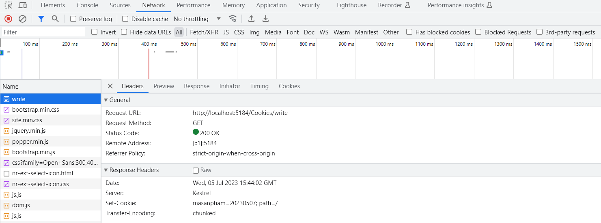
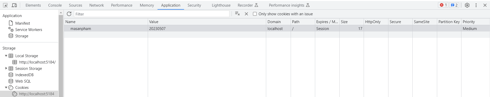
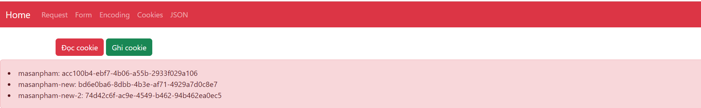

# Tích hợp webpackage
npm init -y                                         # tạo file package.json cho dự án
npm i -D webpack webpack-cli                        # cài đặt Webpack
npm i node-sass postcss-loader postcss-preset-env   # cài đặt các gói để làm việc với SCSS
npm i sass-loader css-loader cssnano                # cài đặt các gói để làm việc với SCSS, CSS
npm i mini-css-extract-plugin cross-env file-loader # cài đặt các gói để làm việc với SCSS
npm install copy-webpack-plugin                     # cài đặt plugin copy file cho Webpack
npm install npm-watch                               # package giám sát file  thay đổi

npm install bootstrap                               # cài đặt thư viện bootstrap
npm install jquery                                  # cài đặt Jquery
npm install popper.js                               # thư viện cần cho bootstrap

- Sử dụng package webpack để tự động build file scss thành file css, đồng thời copy các file bootstrap.min.css,bootstrap.min.js,
jquery.min.js,popper.min.js từ các package bootstrap, jquery đã tải trong thư mục node_modules vào wwwroot
+ Code trong file `webpack.config.js` để thực hiện việc copy đó:
```js
// Copy JS
new CopyPlugin({
    patterns:
        [
            { from: 'node_modules/jquery/dist/jquery.min.js', to: 'js/jquery.min.js' },
            { from: 'node_modules/bootstrap/dist/js/bootstrap.min.js', to: 'js/bootstrap.min.js' },
            { from: 'node_modules/popper.js/dist/popper.min.js', to: 'js/popper.min.js' },
            { from: 'node_modules/bootstrap/dist/css/bootstrap.min.css', to: 'css/bootstrap.min.css' },
        ]
}),
```
- Để mỗi lần thay đổi các file scss tự động build lại css thành ta thêm task vào trong `webpack.config.js`:
```json
"watch": {
"build": "src/scss/site.scss"
},
"scripts": {
"test": "echo \"Error: no test specified\" && exit 1", 
"build": "webpack",
"watch": "npm-watch"
}
```
+ Để chạy tính năng watch đó ta sử dụng: `npm run watch`, trong khi dùng `npm run build` thì chỉ build có 1 lần rồi dừng

# Cookie:
- Là dữ liệu nhỏ do server gửi về cho các trình duyệt. Khi nhận được thì các trình duyệt sẽ lưu trữ lại để các lần sau sẽ gửi cookie này lại cho server. Thường thì sử dụng cookie để lưu trữ các phiên làm việc vd khi user đã đăng nhập thì server gửi cookie về, thì lần sau user đó đăng nhập thì trình duyệt gửi lại cookie đó lên server thì phiên làm việc đó được phục hồi và biết rằng user đã đăng nhập và không cần yêu cầu đăng nhập nữa.


- Sau khi ghi cookie thì client lưu lại và khi thực hiện 1 request nó sẽ gửi kèm cookie lần trước đó lên server


- Thay vì tạo ra 2 method GET,POST và cả 2 làm cùng 1 nhiệm vụ chỉ khác về HTTP method thì ta có thể làm như sau:  
Thay vì: 
```csharp
endpoint.MapGet("/Form", async context =>
{
    var menu = HtmlHelper.MenuTop(HtmlHelper.DefaultMenuTopItems(), context.Request);

    var formHtml = await RequestProcess.ProcessSubmitFormAsync(context.Request);

    string html = HtmlHelper.HtmlDocument("Test submit form html", menu + formHtml);
    await context.Response.WriteAsync(html);
});

endpoint.MapPost("/Form", async context =>
{
    var menu = HtmlHelper.MenuTop(HtmlHelper.DefaultMenuTopItems(), context.Request);

    var formHtml = await RequestProcess.ProcessSubmitFormAsync(context.Request);

    string html = HtmlHelper.HtmlDocument("Test submit form html", menu + formHtml);
    await context.Response.WriteAsync(html);
});
```
Ta làm như sau:
```csharp
endpoint.MapMethods("/Form", new string[] { "POST", "GET" }, async context =>
{
    var menu = HtmlHelper.MenuTop(HtmlHelper.DefaultMenuTopItems(), context.Request);

    var formHtml = await RequestProcess.ProcessSubmitFormAsync(context.Request);

    string html = HtmlHelper.HtmlDocument("Test submit form html", menu + formHtml);
    await context.Response.WriteAsync(html);
});
```

# Cách đọc nội dung 1 file:
```csharp
// Đường dẫn tính từ thư mục chứa project hiện tại, đây đang đọc file 
// chứ không phải href mà dùng đường dẫn tuyệt đối hay tương đối của url

// Nếu nghĩ là dùng: "../FormSubmit.html" thì tìm file html đó trong thư mục cha của projec hiện tại
// Còn nếu nhầm "/FormSubmit.html" thì nó tìm file html trong ổ đĩa hiện tại
// vd D://ForSubmit.html
var format = await File.ReadAllTextAsync("./FormSubmit.html");
```
