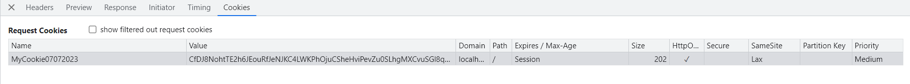

# Session
- Là dữ liệu của phiên làm việc. Khi ta sử dụng session thì dữ liệu của phiên làm việc được lưu trữ lại và chia sẻ giữa các lần truy vấn. Ví dụ session lưu trữ thông tin người dùng đăng nhập thì khi người dùng đó truy vấn đến các trang khác nhau thì nó biết là người dùng dã đăng nhập. Hoặc với việc mua hàng, khi người dùng đặt hàng ở các trang khác nhau sau đó đi đến trang thanh toán thì server biết được người đó đã mua những món nào và hiển thị ra
- Để làm việc vói session thì cài:
```
dotnet add package Microsoft.AspNetCore.Session
```
+ Dữ liệu Session lưu trữ trên Server có thể là ở bộ nhớ Cache, có thể là ở CSDL SQLServer hoặc những nguồn lưu cache khác nhau. Ở đây ta sẽ sử dụng bộ nhớ làm Storage lưu dữ liệu Session. Để ứng dụng sử dụng Session thêm vào dự án Package như sau:
```
dotnet add package Microsoft.Extensions.Caching.Memory
``` 
- Thêm vào pipeline 1 SessionMiddleware thông qua: app.UseSession();
+ Khi HttpContext đi qua SessionMiddleware thì dữ liệu của phiên làm việc sẽ được phục hồi vào thuộc tính của `HttpContext` (thuộc tính `Session` của `HttpContext`)
+ Thường thì SessionMiddleware sẽ gửi về cho client Cookie chứa Id của session. Trình duyệt sẽ lưu lại Id của session và lần request sau sẽ gửi đến server. Và căn cứ vào Cookie đấy mà SessionMiddleware phục hồi lại dữ liệu mà nó đang lưu trữ trong bộ nhớ (lưu trong thuộc tính `Session` của `HttpContext`)

+ Mỗi lần truy cập sau thì nó sẽ gửi cookie với name và value lên cho server. Và SessionMiddleware căn cứ vào cookie này để phục hồi lại dữ liệu của session đang lưu trong bộ nhớ
+ Cookie này có thể được phục hồi ở bất kì trang nào nếu mình muốn
+ Toàn bộ session lưu ở cache sẽ bị mất nếu ta restart lại ứng dựng
- Có thể lưu dữ liệu session nhiều nơi. Đối tượng quản lí session thực tế nó implement từ IDistributedCache. Từ interface này nó triển kai ra một số trường hợp
+ services.AddDistributedMemoryCache(); là ta đang lưu lại tại bộ nhớ cache
+ Lưu ở server RedisCache
+ Lưu ở Sql server: install 2 package sau ở `local project`
```
dotnet new tool-manifest # if you are setting up this repo
dotnet tool install --local dotnet-sql-cache --version 7.0.8
```
Sau đó chạy: để tạo ra bảng MySession trong DB appMVC
```
dotnet sql-cache create "Data Source=localhost,1433; Initial Catalog=appMVC; User ID=sa;Password=taiphan2403;TrustServerCertificate=true" dbo MySession
```
Tiếp theo add package: `Microsoft.Extensions.Caching.SqlServer` để dùng được `services.AddDistributedSqlServerCache`
- Khi lưu dữ liệu sql server thì dù restart ứng dụng cũng không bị mất session nhưng với điều kiện là session vẫn có thời hạn.
Khi thiết lập:  
`options.IdleTimeout = new TimeSpan(0, 2, 0);` thì nghĩa là thiết lập khoảng thời gian (2 phút) thì session `sẽ bị hết hạn` nếu nó `không được thao tác (Get,Set)`. Mỗi lần Get,Set thì nó sẽ cập nhật lại cột Expire at time của session trong DB. Lưu ý thời gian này độc lập với thời gian hết hạn của Cookie. Nếu sau khoảng thời gian này mà cookie vẫn gửi lên thì nó sẽ tạo lại session

