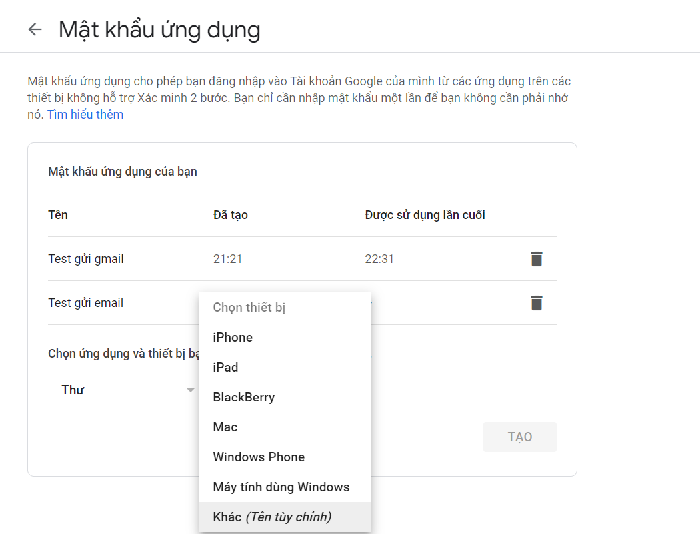
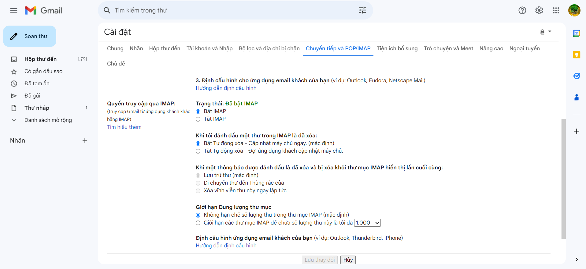
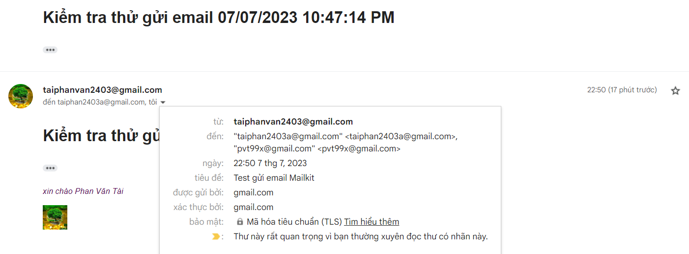

# Gửi mail
Trong C# để gửi mail ta dùng SmtpClient
- Để có thể gửi gmail thông qua StmpClient được thì cần:
+ Mật khẩu ứng dụng:
Vào: https://myaccount.google.com/security -> Chọn `"Xác minh 2 bước"` -> Kéo xuống chọn `Mật khẩu ứng dụng`

+ Cấu hình cho gmail sender:
---
**1. Gửi mail bằng Gmail:**
- Gmail có địa chỉ server SMTP tại: smtp.gmail.com bạn có thể tạo ra SmtpClient kết nối đến Server này để gửi mail, thông tin để kết nối cần cung cấp bao gồm:
    + Server SMTP: smtp.gmail.com
    + Cổng kết nối: 587
    + Ssl: phải kích hoạt
    + Xác thực: Phải xác thực kết nối bằng cách cung cấp tài khoản (địa chỉ email google) và mật khẩu ứng dụng

2. Dùng MailKit gửi Mail trong ASP.NET với Gmail:
- SmtpClient mặc dù vẫn được dùng nhưng .NET đánh dấu nó lỗi thời về khuyên dùng MailKit. Để tích hợp thư viện MailKit bạn thực hiện các lệnh:
```
dotnet add package Mailkit 
dotnet add package MimeKit
```
+ Mục đích là để việc gửi mail như 1 dịch vụ của ứng dụng web của mình. Cách thức `xây dựng dịch vụ gửi mail` nằm trong `thư mục Services`
+ Kết quả gửi mail:
