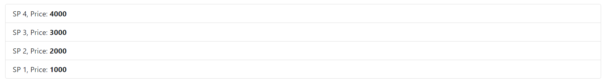

# Partial view
- Là file cshtmlkhoong có chỉ thị @page ở đâu. Mục đích là chia file cshtml lớn thành nhiều file cshtml nhỏ hơn
- Các file này được lưu ở các thư mục giống như lưu Layout:
    + /Pages
    + /Pages/Shared
    + /Views/Shared
- Cách chèn nội dung parital vào razor page:
    + C1 Dùng `<partial name>` 
    + C2 Gọi phương thức `await Html.PartialAsync("_ProductItem")`
    + C3: Gọi trong cặp @{ }
```cs
@{
    // Gọi partial view cách 3 trong khối code
    await Html.RenderPartialAsync("_ProductItem");
}
```
# Chú ý:
- Add headers như sau để nó redirect đến 1 trang khác sau một số giây nào đó:
`this.HttpContext.Response.Headers.Add("REFRESH", $"{thời gian đợi};URL={URL chuyển hướng}");`
# Bootstrap:
- Class card để tạo ra 1 hộp có header, body  
vd:
```html
<!-- Sử dụng card để tạo hôpk -->
<div class="card my-4" style="width: 20rem">
    <!-- Sử dụng card-header tạo header -->
    <h2 class="card-header text-info">Tên sản phẩm</h2>
    <div class="card-body">
        <p class="card-text">Thông tin tóm tắt về sản phẩm</p>
        <a href="#!" class="btn btn-danger btn-sm">Đặt hàng</a>
    </div>
</div>
```
- text-info: màu chữ theo màu info
- my-4:  để margin top và margin bottom (my-1 -> my-5)
- Sử dụng `<ul class = "list-group">` kết hợp với` <li class="list-group-item">` để tạo các dòng để hiển thị nội dung

# Component:
- Tương tự Partial view
- Là các view con có thể được chèn vào file cshtml, có dùng kĩ thuật DI để inject các dịch vụ của hệ thống vào component. Các component giống như trang razor page nhỏ
- Các component lưu file teo thư mục sau:
```
/Views/{Controller Name}/Components/{View Component Name}/{View Name}
/Views/Shared/Components/{View Component Name}/{View Name}
/Pages/Shared/Components/{View Component Name}/{View Name}
```
+ Do đang làm với razor web nên sẽ dùng cách 3
- Các component phải đảm bảo 2 điều kiện sau:
+ Thiết lập lớp này có attribute `[ViewComponent]` hoặc khai báo tên lớp có hậu tố ViewComponent hoặc kế thừa từ ViewComponent (* nên dùng cách này)
+ Để nó được coi là Component thì nó phải có Invoke() hoặc InvokeAsync() trong đó:
    * Invoke(có thể có param) phai trả về string/IViewComponentResult
+ Để truyền dữ liệu model sang view của Component thì sử dụng:
`return View<type>(data);`
- Phương thức Invoke có thể truyền tham số và tham số là có kiểu bất kì
- Trong Component ta có thể inject DI vào để sử dụng
- Ở các handler của PageModel có thể trả về nội dung của Component thông qua ViewComponent, Partial  
Vd sử dụng trong `Handler OnPost` của `PageModel Index`: 
```cs
public IActionResult OnPost()
{
    string username = this.Request.Form["username"];
    var message = new Message()
    {
        Title = "Thông báo",
        HtmlContent = $"Cảm ơn {username} đã gửi thông báo",
        // urlRedirect = "/Index",
        urlRedirect = Url.Page("Privacy"),
        secondWait = 5
    };

    // Trả về nội dung của component
    return ViewComponent("MessagePage", message);
}
```