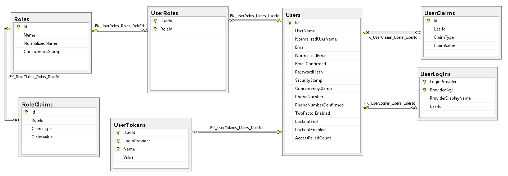
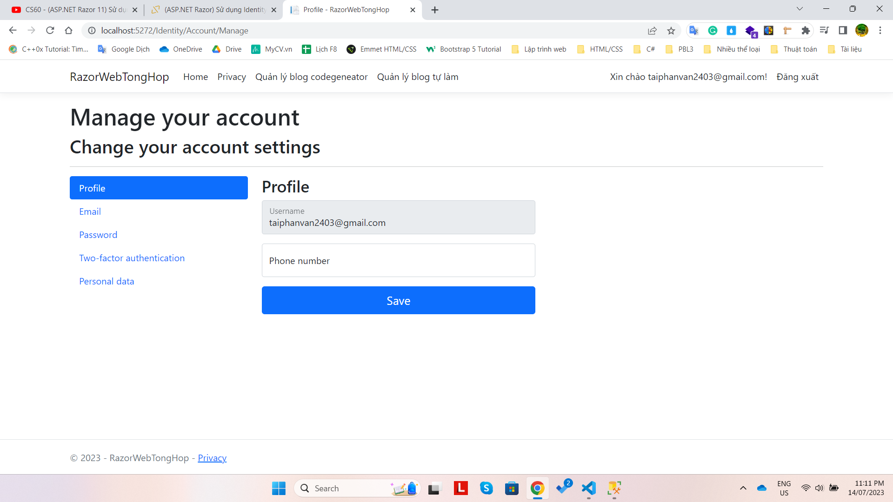
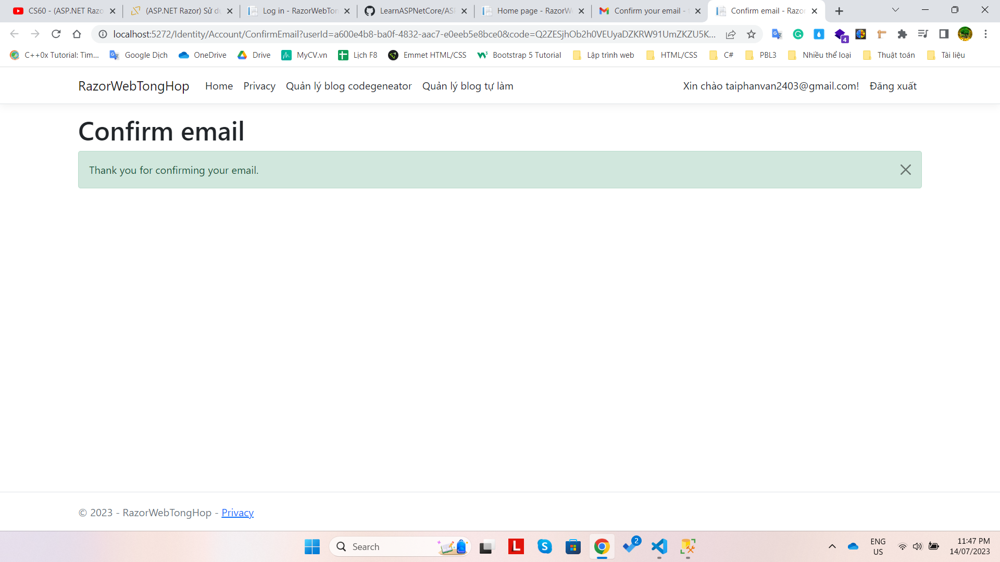
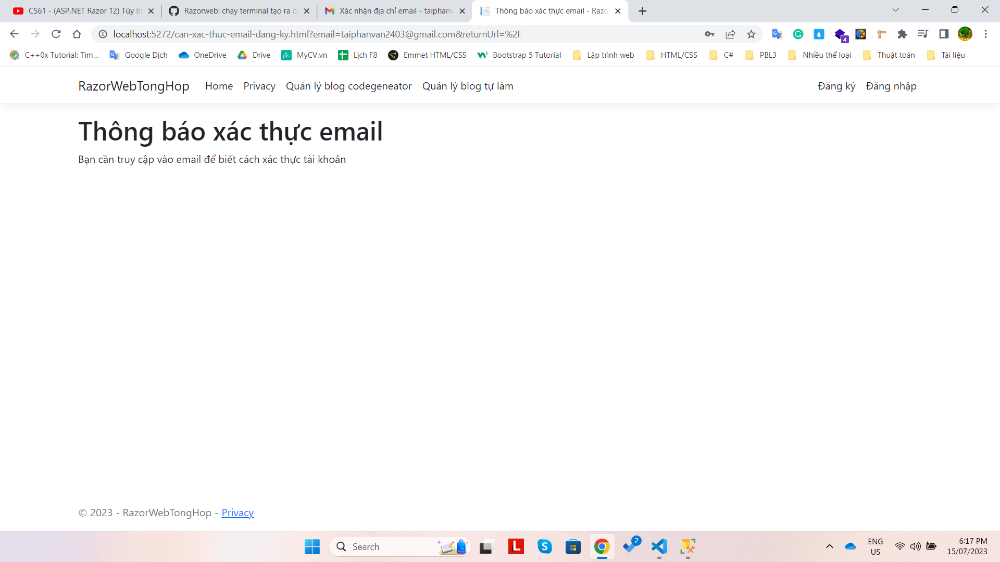

# Ghi chú:
- Để không cho người dùng edit 1 input nào đó nhưng vẫn muốn giá trị của nó được submit thì dùng `readonly="readonly"` cho thẻ input đó
-  Khi dùng `<td>@Html.DisplayFor(model => article.CreateAt)</td>` sẽ lấy giá trị của property CreateAt đồng thời kết hợp thêm các DataAnnotation để hiển thị, cụ thể giá trị dưới CSDL có cả time nhưng ở property là Date nên nó sẽ chỉ hiển thị Date
- Khi submit dữ liệu từ một form và không cung cấp dữ liệu cho một property của model, thì khi server nhận được yêu cầu, giá trị của property đó trong model sẽ được thiết lập về giá trị mặc định của kiểu dữ liệu tương ứng.
# Các package cần sử dụng khi làm việc với EF sử dụng Sqlserver:
- dotnet add package Microsoft.VisualStudio.Web.CodeGeneration.Design
- dotnet add package Microsoft.EntityFrameworkCore.Design
- dotnet add package Microsoft.EntityFrameworkCore.SqlServer
- Có thể cài thêm: `dotnet tool install --global dotnet-aspnet-codegenerator` nếu chưa có. Hiện tại nếu có rồi thì sẽ thông báo: `Tool 'dotnet-aspnet-codegenerator' is already installed.`
- localhost <=> 1270.0.0.1
# Attribute:
- Vd có property là DateTime và muốn thiết lập dữ liệu nó lưu dưới DB là Date thì có thể dùng 1 trong 2 cách:
    + `[Column(Typename="date")]`
    + Hoặc dùng FluentAPI:
    ```cs
    modelBuilder.Entity<Article>()
        .Property(e => e.CreateAt)
        .HasColumnType("date");
    ``` 
    => Các kiểu dữ liệu khác là tương tự
- Dùng `[DataType(DataType.Date)]` chỉ giúp thay đổi giá trị hiển thị thôi chứ không ảnh hưởng đến type khi lưu xuống CSDL
# Entity framework:
- `dotnet-ef database drop -f` để xóa Db mà không hỏi yes/no
- Có thể tạo ra dữ liệu mẫu bằng thư viện Bogus: `dotnet add package Bogus --version 34.0.2`
- `dotnet aspnet-codegenerator razorpage -m RazorWebTongHop.Models.Article -dc RazorWebTongHop.Models.DataContext -udl -outDir Pages/Blog --referenceScriptLibraries` để tạo ra các thao tác CRUD cho model Article sử dụng DataContext. 
    + Lưu ý: Để chạy được thì cài thêm package: `Microsoft.EntityFrameworkCore.Tools`
- Nếu tạo 1 page trong 1 thư mục nào đó: dotnet new page -n `<tên page>`  -o `<thư mục lưu>` -p:n (hoặc --namespace) `<tên namespace>`  
Ví dụ: `dotnet new page -n Create -o Pages/BlogMySelf --namespace RazorWebTongHop.Pages.BlogMySelf`
# Sử dụng thư viện Identity
- Cung cấp chức năng để quản lý người dùng như đăng kí, đăng nhập, xác thực tài khoản, xác định quyền truy cập đến các tài nguyên của ứng dụng.
- Các package quan trọng cần add: 
```
dotnet add package Microsoft.AspNetCore.Identity
dotnet add package Microsoft.AspNetCore.Identity.EntityFrameworkCore
dotnet add package Microsoft.AspNetCore.Identity.UI
```
+ Khi muốn xác thực từ Facebook, Google, Microsoft,.. thì cần add các package sau:
```
dotnet add package Microsoft.AspNetCore.Authentication
dotnet add package Microsoft.AspNetCore.Http.Abstractions
dotnet add package Microsoft.AspNetCore.Authentication.Cookies
dotnet add package Microsoft.AspNetCore.Authentication.Facebook
dotnet add package Microsoft.AspNetCore.Authentication.Google
dotnet add package Microsoft.AspNetCore.Authentication.JwtBearer
dotnet add package Microsoft.AspNetCore.Authentication.MicrosoftAccount
dotnet add package Microsoft.AspNetCore.Authentication.oAuth
dotnet add package Microsoft.AspNetCore.Authentication.OpenIDConnect
dotnet add package Microsoft.AspNetCore.Authentication.Twitter
```
- Thư viện cung cấp chức năng xác định danh tính Authentication -> Login, Logout
- Authorization: xác định quyền truy cập đến các tài nguyên
- Cung cấp chức năng quản lí user: Sign-up, user, role,...
- Sau khi app.UseRouting() cần có 2 middleware: 
```cs
app.UseRouting();

// Chú ý phải có 2 middleware này
app.UseAuthentication();
app.UseAuthorization();
```
+ Hai middleware này được dùng để phục hồi các thông tin đã đăng nhập, đã xác thực
- Thông tin lưu trữ về user, phân quyền user được identity lưu trữ tại CSDL
## Các việc cần làm:
- Tạo ra 1 model để kế thừa từ IdentityUser. Trong class IdentityUser này đã có sẵn 1 số thuộc tính như Username, Email, PasswordHash, PhoneNumber,... Mục đích kế thừa là khi ta muốn `bổ sung thêm 1 số thuộc tính` mà trong class IdentityUser chưa có sẵn.
- Trong class IdentityDbContext đã có sẵn một số Dbset tương ứng với các bảng trong hình sau:

+ Do `IdentityDbContext` cũng triển khai từ `DbContext` nên giờ class `DataContext` của ứng dụng cũng sẽ kế thừa được từ `IdentityDbContext`
+ Khi `DataContext : IdentityDbContext<AppUser>` thì ngoài các DbSet của ứng dụng thì Identity còn tạo ra các DbSet tương ứng với các bảng trong ảnh trên. Do đó ta cần phải tiến hàn migrations. Các bảng mặc đinh của Identity khi tạo ra sẽ có tiền tố AspNet, có thể loại bỏ nó.
- Đăng kí Identity cho ứng dụng:
```cs
services.AddIdentity<AppUser, IdentityRole>()
        .AddEntityFrameworkStores<DataContext>()
        .AddDefaultTokenProviders();
```
- Các trang giao diện mặc định ̣(nhờ có package `Microsoft.AspNetCore.Identity.UI`):
+ /Identity/Account/Login
+ /Identity/Account/Manage
Tuy nhiên cần tạo ra partial _LoginPartial trước khi truy cập các url liên quan đến Identity.
```
The default Identity UI layout requires a partial view '_LoginPartial' usually located at '/Pages/_LoginPartial' or at '/Views/Shared/_LoginPartial' to work
``` 
+ Đặt _LoginPartial 1 trong các vị trí sau:
```
/Areas/Identity/Pages/Account/_LoginPartial.cshtml
/Areas/Identity/Pages/_LoginPartial.cshtml
/Areas/Identity/Pages/Shared/_LoginPartial.cshtml
/Areas/Identity/Views/Shared/_LoginPartial.cshtml
/Pages/Shared/_LoginPartial.cshtml
/Views/Shared/_LoginPartial.cshtml.
```
- Các trang giao diện của Identity được đặt ở Areas/Identity
- Các dịch vụ của Identity:
+ `SignInManager<AppUser>`
+ `UserManager<AppUser>`
=> Từ 2 dịch vụ này ta có thể đọc được thông tin về 1 user nào đó. Để dùng được thì ta có thể inject 2 dịch vụ này vào để dùng. Có thể inject 2 dịch vụ này vào view, Controller, PageModel. Inject trực tiếp ở view thông qua @inject
- Trong các Controller, PageModel, view đều có property là User (property này có kiểu ClaimsPrincipal) chứa thông tin đăng nhập của user. Thuộc tính này được thiết lập trong mỗi truy vấn do 2 middleware Authentication và Authorization. Ta có thể biết được người dùng đã đăng nhập hay chưa thông qua phương thức `signInManager.IsSignedIn(User)`. Dựa vào đây để biết được người dùng đã đăng nhập chưa để rồi hiển thị navigation tương ứng

- Khi đăng kí thành công rồi nhưng khi đăng nhập lại không được do ta thiết lập 
options.SignIn.RequireConfirmedEmail = true; nên phải thêm bước xác thực nữa mới được. Do đó cần gửi mã xác thực về mail => Cần sử dụng Mailkit để gửi mail
+ Packages:
```
dotnet add package MailKit
dotnet add package MimeKit
```
+ Do sử dụng các trang mặc định:
```cs
// Sử dụng trang mặc định
services.AddDefaultIdentity<AppUser>()
        .AddEntityFrameworkStores<DataContext>()
        .AddDefaultTokenProviders();
``` 
nên khi ta đăng kí thì nó tự động gửi mã đường link xác thực về email cho mình. Và nhiệm vụ là phải tạo ra một lớp SendMailServices implement IEmailSender và add service đó vào ứng dụng. Chú ý là phải add như sau:
```cs
services.AddOptions();
// Lấy section ra, tạo 1 service option để ánh xạ vào các key vào thuộc tính của MailSettings
var mailSettings = builder.Configuration.GetSection("MailSettings");
services.Configure<MailSettings>(mailSettings);

services.AddSingleton<IEmailSender, SendMailService>();
```

- Phát sinh cá trang identity để tự custom lại:
dotnet aspnet-codegenerator identity -dc RazorWebTongHop.Models.DataContext
+ Nếu trong Program.cs đã thiết lập AddIdentity rồi thì phải comment lại trước khi chạy lệnh termninal đó.
Nếu không thì sẽ bị quăng ra lỗi `Microsoft.AspNetCore.Identity.IdentityBuilderExtensions.AddDefaultTokenProviders(Microsoft.AspNetCore.Identity.IdentityBuilder)' and 'Microsoft.AspNetCore.Identity.IdentityBuilderExtensions.AddDefaultTokenProviders(Microsoft.AspNetCore.Identity.IdentityBuilder)`
```cs
// Cần comment đoạn này lại
services.AddDefaultIdentity<AppUser>()
        .AddEntityFrameworkStores<DataContext>()
        .AddDefaultTokenProviders();
```
# Tùy biến (Customize) trang Register, RegisterConfirmation, ConfirmEmail (15/07/2023)
- Thêm `[Authorize]` vào đầu các PageModel để chuyển hướng đến trang đăng nhập nếu người dùng chưa đăng nhập khi truy cập các trang này
- Do PageModel `Register` có đăng kí vào dịch vụ là `IEmailSender` nên đó là lí do ta tạo `SendMailService` implement `IEmailSender` và thêm dịch vụ vừa tạo vào ứng dụng kiểu `services.AddSingleton<IEmailSender, SendMailService>();`
- Màn hình khi hoàn tất việc đăng ký tài khoản và cần thêm bước xác thực tại email
