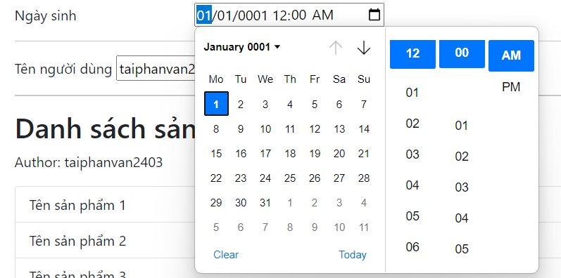
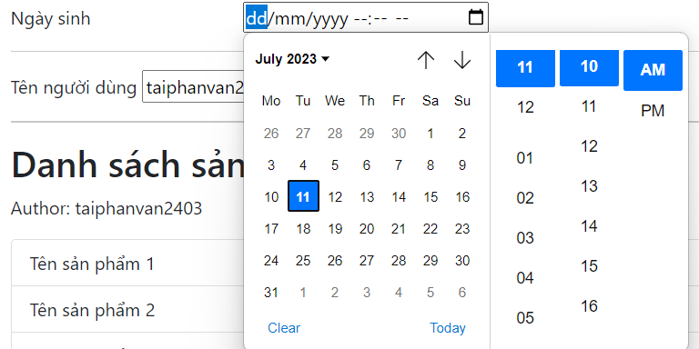
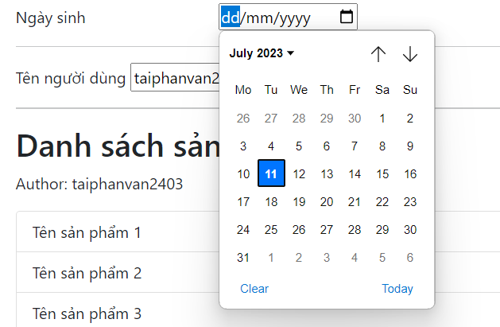
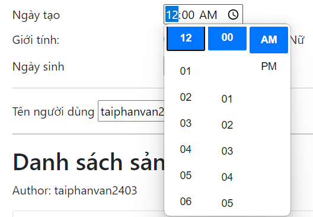

# Tag Helper
- Do đã được tự động nạp nội dung của _ViewImport.cshtml vào đầu mỗi file cshtml và trong file _ViewImport này có : `@addTagHelper *, Microsoft.AspNetCore.Mvc.TagHelpers` nên các file cshtml mới dùng được TagHelper
- Anchor tag helper: 
- Label tag helper: `<label asp-for="UserName"></label>`
+ Lúc này sẽ phát sinh ra label tương ứng với phần tử được phát sinh UserName
+ Lúc này thư viện sẽ tạo ra thẻ label trong HTML như sau:
`<label for="UserName"></label>`
- Input tag helper: Vd model có property UserName có giá trị mặc định là taiphanvan2403 thì khi dùng InputTagHelper nó sẽ sinh ra thẻ input như sau:
`<input type="text" data-val="true" data-val-required="The Tên người dùng field is required." id="UserName" name="UserName" value="taiphanvan2403">`
+ input tự động thiết lập type, id, name (tên biến khi submit), require ,...
+ InoutTagHelper dựa vào kiểu dữ liệu của property, DataAnnotation, .. để thiết lập id, name, value cho nó
    * Nếu kiểu dữ liệu DateTime thì khi hiển thi ra màn hình nó sẽ có giá trị mặc định value là "01/01/0001 giờ,..."
      


    * Nếu không muốn hiển thị giá trị mặc định thì thêm vào InputTagHelper thuộc tính `value = ""`
      


    * Với kiểu dữ liệu DateTime nhưng dùng `[DataType(DataType.Date)]` thì sẽ hiển thị ra giao diện Date thôi
      


    * Với kiểu dữ liệu DateTime nhưng dùng `[DataType(DataType.Time)]` thì sẽ hiển thị ra giao diện Time thôi  
    
    
# Html Helper:
- Cũng dùng để phát sinh ra code HTML, giống với TagHelper nhưng cách này là sử dụng phương thức của C#. Nếu được thì `nên dùng TagHelper, hạn chế dùng HtmlHelper`
```
@Html.Label("UserName")
@Html.TextBox("UserName")
```